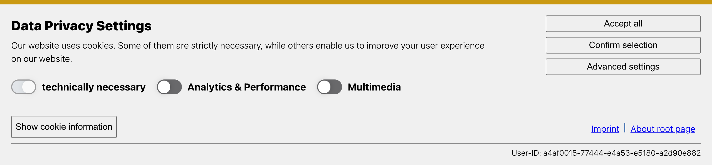
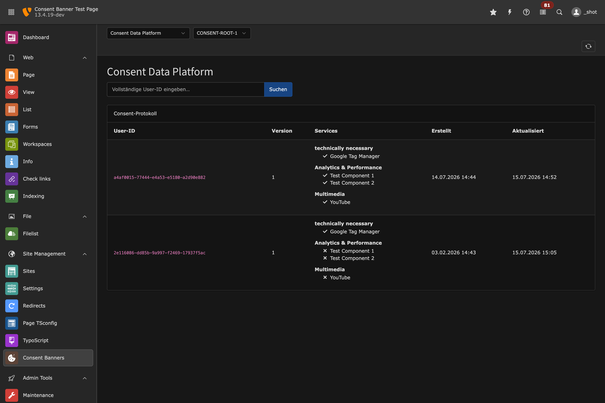
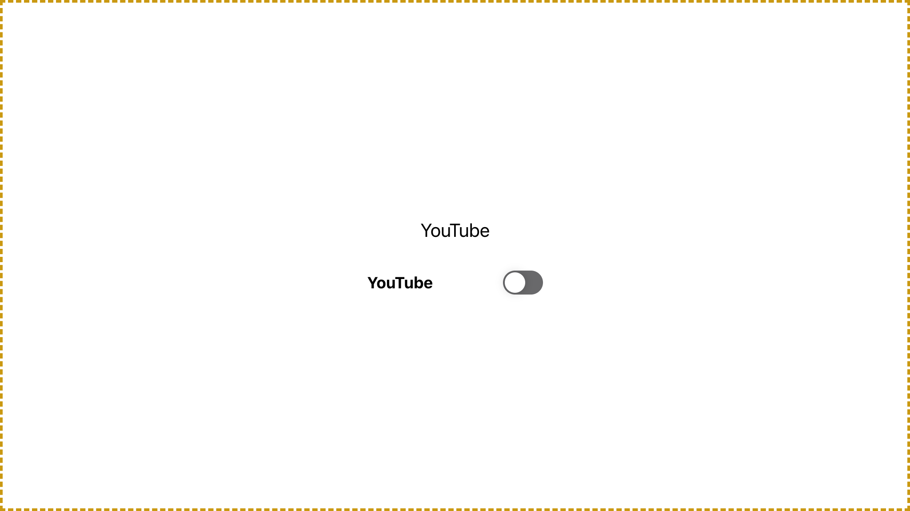

# Consent Banner – Anwenderhandbuch (Installation, Einrichtung & Nutzung)

Dieses Handbuch richtet sich an **TYPO3-Redakteur:innen und Administrator:innen** mit
grundlegenden TYPO3-Kenntnissen. Es beschreibt Installation, Einrichtung und den
redaktionellen Einsatz der Extension **Consent Banner** (`bb/consent_banner`) sowie den
sicheren Umgang mit eigenen Content-Elementen und dem TYPO3-Content-Element **„HTML"**.

> **Hinweis zur Verlässlichkeit der Angaben**
> Technische Fakten in diesem Dokument (Feldnamen, Klassennamen, Pfade, TypoScript,
> Frontend-Verhalten) beziehen sich auf **Extension-Version 1.2.1**. Versionsabhängige
> Stellen sind ausdrücklich gekennzeichnet. Prüfe projektspezifische Werte in eckigen
> Klammern `[…]` vor Veröffentlichung dieses Handbuchs.

### Vor Veröffentlichung dieses Handbuchs zu ergänzen / zu prüfen

| Platzhalter | Bedeutung | Status |
|-------------|-----------|--------|
| `[TYPO3_VERSION]` | Konkrete TYPO3-Version der Zielinstallation | zu prüfen (unterstützt: 13.4–14.3) |
| `[EXTENSION_VERSION]` | Installierte Extension-Version | bekannt: **1.2.1** |
| `[INSTALLATIONSMETHODE]` | Composer / Extension Manager | Extension ist **Composer-basiert** |
| `[ZIELUMGEBUNG]` | Entwicklung / Test / Produktion | zu ergänzen |
| `[SITEPACKAGE_ODER_TEMPLATE]` | Verwendetes Sitepackage/Template | zu ergänzen |
| `[SITE_IDENTIFIER]` | Identifier der Site-Konfiguration | zu ergänzen |
| `[BASIS_DOMAIN]` | Öffentliche Domain der Site | zu ergänzen |

---

## 1. Voraussetzungen

### 1.1 Versionen (gesichert für Extension 1.2.1)

| Komponente | Anforderung |
|-----------|-------------|
| TYPO3 CMS | 13.4 – 14.3 |
| PHP | 8.3 – 8.4 |
| Composer | für Installation erforderlich |

> **Versionsabhängig:** Bei anderen TYPO3-/PHP-Versionen als oben kann das Verhalten
> abweichen. Verlasse dich nicht auf Kompatibilität außerhalb dieser Spanne, ohne sie in
> `[ZIELUMGEBUNG]` zu testen.

### 1.2 Zugriffsrechte

- **Installation & Aktivierung:** Kommandozeilen-/Deployment-Zugriff auf das Projekt
  (Composer) sowie ein TYPO3-Backend-Konto mit **Admin-Rechten**.
- **Redaktion:** Backend-Konto mit Zugriff auf das Modul **Consent Banners** sowie
  Schreibrechte auf der jeweiligen **Root-Seite** der Site (dort wird der Banner-Datensatz
  gespeichert).

### 1.3 Abhängigkeiten und Vorbereitungen

- Eine funktionierende **Site-Konfiguration** (`[SITE_IDENTIFIER]`) mit gesetzter
  Root-Seite. Pro Site wird **ein** Banner-Datensatz verwaltet.
- Das Frontend muss über TYPO3-Seitenrendering laufen, damit die automatische Einbindung
  (siehe Abschnitt 3.2) greift.
- Für **Google Consent Mode**, **Matomo** oder **Script**-Dienste die jeweiligen
  Kennungen bereithalten (GTM-Container-ID, Matomo-URL/Site-ID, Script-Snippets).

---

## 2. Installation

> **Empfohlene Methode: Composer.** Die Extension ist ein `typo3-cms-extension`-Paket und
> für Composer-Installationen ausgelegt.

### 2.1 Repository eintragen und installieren

In der Root-`composer.json` des TYPO3-Projekts das Paket-Repository ergänzen:

```json
"repositories": [
    { "type": "path", "url": "local_packages/*" },
    { "type": "vcs",  "url": "https://github.com/berbach/typo3-consentbanners.git" }
]
```

Anschließend das stabile Release installieren:

```bash
composer require bb/consent_banner:^1.2 --prefer-dist
```

- `^1.2` installiert das aktuelle stabile Release (Tag `v1.2.1`).
- `--prefer-dist` lädt ein schlankes Archiv ohne Build-Toolchain (per `.gitattributes`
  ausgeschlossen), sodass nur die für den Betrieb nötigen Dateien installiert werden.

### 2.2 Extension aktivieren

Bei Composer-Installationen wird die Extension über den Paketstand aktiviert. Datenbank-
und Systemschritte anschließend ausführen:

```bash
# Datenbankschema anlegen/aktualisieren
vendor/bin/typo3 extension:setup

# Alle Caches leeren
vendor/bin/typo3 cache:flush
```

> ⚠️ **Warnung (Produktion):** `cache:flush` leert **alle** Caches und kann kurzzeitig zu
> erhöhter Last führen. In `[ZIELUMGEBUNG] = Produktion` in einem Wartungsfenster ausführen.

### 2.3 Erfolgskontrolle

1. Im Backend erscheint das Modul **Consent Banners** (siehe Abschnitt 4).
2. Die folgenden Datenbanktabellen existieren (Prüfung über *Installaton → Datenbankanalyse*
   oder DB-Client):
   - `tx_consentbanner_domain_model_banner`
   - `tx_consentbanner_domain_model_consent_groups`
   - `tx_consentbanner_domain_model_consent_components`
   - `tx_consentbanner_domain_model_consent_log`
3. Das Site-Set **„Berbach Consent Banner"** ist in der Set-Auswahl verfügbar
   (siehe Abschnitt 3.1).

> **Prüfanweisung, falls das Modul fehlt:** Composer-Autoload neu aufbauen
> (`composer dumpautoload`), Caches leeren, und sicherstellen, dass das Backend-Konto
> Admin-Rechte hat.

---

## 3. Grundeinrichtung

### 3.1 Site-Set aktivieren (erforderlich)

Damit Banner-Ausgabe und Consent-Mode-Bootstrap im Frontend greifen, muss das Site-Set
der Site zugeordnet sein:

1. Backend → **Site-Management → Sites** (bzw. *Websites*), Site `[SITE_IDENTIFIER]` öffnen.
2. Im Bereich **Sets / Set-Auswahl** das Set **„Berbach Consent Banner"**
   (Name: `bb/consent-banner`) hinzufügen und speichern.

> **Versionsabhängig:** Die Benennung des Set-Bereichs in der Site-Konfiguration kann
> zwischen TYPO3 13 und 14 abweichen. Suche nach dem Set-Namen `bb/consent-banner`.

### 3.2 Frontend-Einbindung (automatisch – normalerweise nichts zu tun)

Das Site-Set bindet alles Nötige automatisch ein; **manuelles TypoScript ist im
Regelfall nicht erforderlich**. Konkret werden gesetzt:

| Was | Wodurch |
|-----|---------|
| Banner-Markup + Daten | `lib.consentbanners` (COA_INT, `ConsentBanner`-Template + `ConsentBannerProcessor`), eingehängt als `page.1633505733` |
| Consent-Mode-Bootstrap im `<head>` | `page.headerData.1633505734 = USER_INT` (`ConsentModeRenderer`) |
| Stylesheet | `page.includeCSS.consentbanner` → `…/Dist/Css/ConsentBanner.css` |
| Frontend-Logik | `page.includeJSFooter.consentbanner` → `…/Dist/JavaScript/CbLoader.js` |

> **Anpassbar:** Template-/Partial-/Layout-Pfade lassen sich über die TypoScript-Konstanten
> `plugin.tx_consentbanner.view.*` in `[SITEPACKAGE_ODER_TEMPLATE]` überschreiben, falls du
> eigene Templates verwenden willst. Ohne Bedarf hier nichts ändern.

### 3.3 Consent-Kategorien und Dienste

Die inhaltliche Konfiguration (Kategorien = *Gruppen*, Dienste = *Components*) erfolgt
vollständig im Backend-Modul und ist in Abschnitt 4 beschrieben. Das Modell hat drei Ebenen:

- **Banner** – ein Datensatz pro Site (auf der Root-Seite).
- **Gruppen** – z. B. *Technisch notwendig* (essenziell, immer aktiv), *Analytics*,
  *Marketing*, *Multimedia*.
- **Components** – einzelne Dienste innerhalb einer Gruppe (z. B. YouTube, Matomo). Jede
  Component bestimmt über ihren **Integrations-Typ** das Frontend-Verhalten.

### 3.4 Verhalten bei bereits erteilten/abgelehnten Einwilligungen

- Die Einwilligungen werden clientseitig gespeichert (Cookie **`BbConsentPreferences`**,
  Struktur `{component_id: true|false}`, zusätzlich `localStorage`).
- Beim erneuten Besuch wird der Banner **nicht** erneut angezeigt, solange:
  - die gespeicherte **Banner-Version** mit der aktuellen übereinstimmt **und**
  - die **Lifetime** (Ablaufzeit) noch nicht überschritten ist.
- Ändert eine Redakteurin den Banner (Banner/Gruppe/Component), wird die
  **Banner-Version automatisch hochgezählt** → beim nächsten Besuch erscheint der Banner
  erneut, damit erneut eingewilligt werden kann.
- Essenzielle Dienste (Gruppe *technisch notwendig*) sind immer aktiv und nicht abwählbar.



*Abb. 6: Der Banner beim Erstbesuch – Einleitungstext, Gruppen-Umschalter (hier
„technisch notwendig", „Analytics & Performance", „Multimedia"), die Buttons
„Alle akzeptieren" / „Auswahl bestätigen" / „Erweiterte Einstellungen" sowie die
Besucher-Kennung (User-ID). Die konkreten Texte stammen aus dem Banner-Datensatz
bzw. der Sprachdatei und können abweichen.*

### 3.5 Mehrsprachigkeit

- Banner-, Gruppen- und Component-Datensätze werden über die **TYPO3-Sprachübersetzung**
  (Sprach-Overlays der jeweiligen Datensätze) mehrsprachig gepflegt.
- Button- und Info-Texte besitzen einen **Fallback auf die mitgelieferte Sprachdatei**,
  wenn im Banner kein eigener Text hinterlegt ist.

> **Prüfanweisung:** Lege in `[ZIELUMGEBUNG]` je Sprache eine Übersetzung des Banner-
> Datensatzes an und prüfe im Frontend pro Sprache Texte und Platzhalter.

### 3.6 Datenschutz- und Accessibility-Grundlage

- Der Banner setzt Cookies/`localStorage` erst mit Interaktion; Consent-Signale starten auf
  `denied` (Consent Mode). Details in Abschnitt 9.
- Das Banner-Markup enthält u. a. `aria-label` an den Umschaltern und
  Checkbox-Bedienelemente. **Vollständige WCAG-Konformität ist projekt- und
  themeabhängig** und muss geprüft werden (Abschnitt 9).

---

## 4. Verwendung im Backend

### 4.1 Modul „Consent Banners" öffnen

**Screenshot 1 – Backend-Modul**
`Documentation/Images/01-module.png`

- **Bildschirm:** TYPO3-Backend, Modul **Consent Banners** (Modulpfad
  `/module/consent-banner`).
- **Sichtbar sein muss:** die Modulüberschrift, die **Site-Auswahl oben rechts** und – falls
  vorhanden – der aktuelle Banner der gewählten Site bzw. der Button
  **„Consent Banner anlegen"**, falls noch keiner existiert.

Schritte:
1. Im Modulmenü **Consent Banners** wählen.
2. Oben rechts über das **Site-Menü** die zu bearbeitende Site auswählen.
3. Ist kein Banner vorhanden → **„Consent Banner anlegen"**. Andernfalls über das
   **Stift-Symbol** in die Bearbeitung wechseln.

### 4.2 Banner bearbeiten

**Screenshot 2 – Banner-Formular (Allgemein)**
`Documentation/Images/02-banner-general.png`

- **Bildschirm:** Bearbeitungsformular des Banner-Datensatzes, erster Tab.
- **Sichtbar sein muss:** die Tab-Leiste des Formulars mit den Registern:
  - **Banner** – Titel, Beschreibung, Sichtbarkeit
  - **Text for labels** – Button-/Cookie-Info-Texte (Fallback: Sprachdatei)
  - **Essential consent group** – die immer aktive Gruppe *technisch notwendig*
  - **Other consent groups** – weitere, abwählbare Gruppen mit ihren Components
  - **Banner setting** – Layout, Opener (Textlink/Button), Lifetimes
  - **Tracking / Consent Mode** – GTM-/Matomo-Konfiguration

Schritte:
1. **Banner**-Tab: Titel und Beschreibung pflegen.
2. **Banner setting**-Tab: Layout und Opener (Textlink oder Button-Widget) sowie die
   **Lifetimes** (Ablauf für erneutes Nachfragen bzw. für die gespeicherte Einwilligung)
   festlegen.
3. **Essential/Other consent groups**: Gruppen und die zugehörigen Components pflegen
   (siehe 4.3).
4. Speichern.

### 4.3 Dienste (Components) und Kategorien (Gruppen) verwalten

Components werden innerhalb der Gruppen im Banner-Formular gepflegt. Jede Component hat
einen **Integrations-Typ**, der das Frontend-Verhalten bestimmt:

**Screenshot 3 – Component: Integrations-Tab**
`Documentation/Images/04-component-integration.png`

- **Bildschirm:** Bearbeitungsformular einer Component, Bereich *Integration*.
- **Sichtbar sein muss:** das Feld **Integrations-Typ** und – je nach Auswahl – die
  abhängigen Felder (z. B. *Target Content Element*, *Consent-Mode-Signale*,
  *Placeholder-Titel/-Text*).

| Integrations-Typ | Verhalten im Frontend |
|------------------|-----------------------|
| **Iframe / Inhaltselement** (Standard) | Blockt das Ziel-Content-Element/den iFrame. Statt des Inhalts erscheint ein Platzhalter; nach Einwilligung wird der echte Inhalt **ohne Reload** eingeblendet (reversibel bei Widerruf). |
| **Google Consent Mode (gtag)** | Setzt `consent`-Signale (`consent update`). Google-Tags laden immer, respektieren aber den Consent-Status. Optionaler GTM-Container. |
| **Matomo** | Steuert die Matomo-Einwilligung über `_paq` (`setConsentGiven`/`forgetConsentGiven`). |
| **Script laden** | Injiziert bei Einwilligung ein hinterlegtes Script (mit CSP-Nonce); bei Widerruf wird es entfernt und ein Aufräum-Script ausgeführt. |

Wichtige Felder je Typ:

- **Iframe / Inhaltselement:** Feld **Target Content Element** (`component_ce_target`) – der/die
  CType(s), die diese Component abdeckt (z. B. `cevideoplayer` für einen YouTube-Player).
  Optional **Placeholder-Titel/-Text** (Fallback: Component-Titel).
- **Google Consent Mode:** Feld **Consent-Mode-Signale** (welche Signale bei Einwilligung auf
  `granted` gesetzt werden, z. B. `analytics_storage`, `ad_storage`). Voraussetzung:
  **GTM-Container-ID** im Banner (Tab *Tracking / Consent Mode*).
- **Matomo:** Voraussetzung: **Matomo-URL + Site-ID** (oder MTM-Container-URL) im Banner.
- **Script laden:**

  **Screenshot 4 – Component: JavaScripts-Tab**
  `Documentation/Images/05-component-javascripts.png`
  - **Bildschirm:** Bearbeitungsformular einer Component, Tab *JavaScripts*.
  - **Sichtbar sein muss:** die Felder für das bei Einwilligung zu injizierende Snippet
    (`accepted_script`) und das Aufräum-Snippet bei Widerruf (`rejected_script`).

### 4.4 Tracking / Consent Mode auf Banner-Ebene

**Screenshot 5 – Banner: Tracking / Consent Mode**
`Documentation/Images/03-banner-tracking.png`

- **Bildschirm:** Banner-Formular, Tab **Tracking / Consent Mode**.
- **Sichtbar sein muss:** die Felder für die **GTM-Container-ID** sowie die
  **Matomo-Konfiguration** (Matomo-URL, Site-ID bzw. MTM-Container-URL).

### 4.5 Redaktioneller Workflow und Prüfungen vor Veröffentlichung

1. Gruppen definieren (mindestens *technisch notwendig* + benötigte Kategorien).
2. Pro Dienst eine Component anlegen, Integrations-Typ + Pflichtfelder setzen.
3. Bei Iframe-Diensten den passenden **CType** in *Target Content Element* eintragen.
4. Speichern → dadurch wird die **Banner-Version** erhöht (erneutes Nachfragen im FE).
5. Im Frontend gegenprüfen (siehe Abschnitt 8), auch pro Sprache.

> ⚠️ **Warnung:** Änderungen am Banner erhöhen die Banner-Version und führen dazu, dass
> **alle Besucher:innen erneut** um Einwilligung gebeten werden. Änderungen bündeln.

### 4.6 Consent-Protokoll einsehen

Im Modul **Consent Banners** wird über das Umschalt-Menü im Kopfbereich von der
Banner-Ansicht auf die **Consent-Protokoll**-Ansicht gewechselt.

**Screenshot 9 – Consent-Protokoll (Backend)**
`Documentation/Images/09-consent-log.png`

- **Bildschirm:** Modul *Consent Banners*, Ansicht *Consent-Protokoll* (Menüpunkt neben der
  Banner-Ansicht), Site oben rechts gewählt.
- **Sichtbar sein muss:** das **Suchfeld** (exakte User-ID) mit *Suchen*, der
  **Reload-Button** oben rechts und die **Protokoll-Tabelle** mit den Spalten *User-ID*,
  *Version*, *Services*, *Erstellt*, *Aktualisiert*. Die Services sind je Eintrag nach
  **Gruppen** strukturiert; ein Haken/Kreuz zeigt die Einwilligung je Dienst.



*Abb. 9: Das Consent-Protokoll listet je Besucher-Kennung (User-ID) die eingewilligten bzw.
abgelehnten Dienste – nach Gruppen gegliedert – samt Banner-Version und Zeitstempeln. Die
Ansicht ist pro Site getrennt; die Suche erwartet die vollständige User-ID.*

- **Suche:** exakte User-ID eingeben (keine Teilstring-Suche).
- **Aufbewahrung:** Beim Öffnen der Ansicht werden abgelaufene Einträge automatisch entfernt
  (Dauer aus der Banner-Konfiguration; siehe Abschnitt 9.1).

---

## 5. Umgang mit eigenen Content-Elementen

Ziel: Inhalte eines eigenen Content-Elements, die **einwilligungspflichtige
Drittanbieter-Ressourcen** einbinden (z. B. ein externer Video-Player, eine Karten- oder
Social-Einbettung), erst **nach Einwilligung** laden.

### 5.1 Inhalte einordnen

| Kategorie | Beispiel | Behandlung |
|-----------|----------|------------|
| **Reiner Inhalt** | Text, lokale Bilder, interne Links | Keine Consent-Behandlung nötig. |
| **Technisch notwendige Ressource** | Eigene, lokal ausgelieferte Skripte/Styles ohne Tracking | In der Regel keine Einwilligung nötig; der Gruppe *technisch notwendig* zuordnen, falls im Banner dargestellt. |
| **Einwilligungspflichtige Drittanbieter-Ressource** | Externer iFrame, Tracking-/Marketing-Script, externe Fonts/Assets mit Personenbezug | Muss über den Consent-Mechanismus geschützt werden (siehe unten). |

### 5.2 Integrationsweg (empfohlen: ViewHelper `cb:allowCookie`)

Die Integration erfolgt im **Fluid-Template des Content-Elements**. Der ViewHelper
`cb:allowCookie` kapselt den zu schützenden Inhalt. Er ermittelt den **CType** des aktuellen
Elements und sucht die Component, deren *Target Content Element* diesen CType abdeckt.

**Schritt A – Template des eigenen CE anpassen** (Datei im `[SITEPACKAGE_ODER_TEMPLATE]`):

```html
<!-- Beispiel-Template für ein eigenes Content-Element mit externem iFrame.
     Der ViewHelper-Namespace "cb" muss deklariert sein. -->
<html xmlns:f="http://typo3.org/ns/TYPO3/CMS/Fluid/ViewHelpers"
      xmlns:cb="http://typo3.org/ns/Bb/ConsentBanner/ViewHelpers"
      data-namespace-typo3-fluid="true">

    <f:section name="Main">
        <cb:allowCookie>
            <!-- ONLY der einwilligungspflichtige Dritt-Inhalt gehört hier hinein.
                 Umgebender, unkritischer Inhalt bleibt AUSSERHALB des ViewHelpers. -->
            <iframe src="[EXTERNE_URL_DES_DRITTANBIETERS]"
                    width="560" height="315" loading="lazy"></iframe>
        </cb:allowCookie>
    </f:section>
</html>
```

Verhalten:
- **Ohne Einwilligung** → an Stelle des Inhalts erscheint ein Platzhalter (mit Titel/Text der
  Component; bei fehlendem Titel greift der Component-Titel als Fallback).
- **Mit Einwilligung** → der echte Inhalt wird gerendert. Wird die Einwilligung im laufenden
  Seitenaufruf erteilt, blendet die Frontend-Logik den Inhalt **ohne Reload** ein
  (und entfernt ihn bei Widerruf wieder).

**Schritt B – Component anlegen, die diesen CType abdeckt** (Backend, siehe 4.3):

1. Neue Component in der passenden Gruppe anlegen (z. B. Gruppe *Multimedia*).
2. Integrations-Typ **Iframe / Inhaltselement** wählen.
3. Feld **Target Content Element** (`component_ce_target`) auf den **CType deines
   Content-Elements** setzen, z. B. `[DEIN_CTYPE]`.
4. Optional **Placeholder-Titel/-Text** pflegen.
5. Speichern.

> **Warum Schritt B nötig ist:** Erst durch das Ziel `component_ce_target` wird dieser CType
> serverseitig **uncached** ausgeliefert (technisch: ein `COA_INT`-Block, automatisch
> erzeugt). Nur so kann pro Aufruf entschieden werden, ob echter Inhalt oder Platzhalter
> erscheint. Ohne diesen Eintrag würde ein gecachtes Element keine
> einwilligungsabhängige Ausgabe erlauben.

> **Platzhalter, die du ersetzen musst:** `[EXTERNE_URL_DES_DRITTANBIETERS]`,
> `[DEIN_CTYPE]`, `[SITEPACKAGE_ODER_TEMPLATE]`.

### 5.3 Prüfung

Im Frontend prüfen: ohne Cookie erscheint der Platzhalter, nach Einwilligung der echte
Inhalt (siehe Test-Checkliste, Abschnitt 8).



*Abb. 7: Gegateter Inhalt ohne Einwilligung – der echte Inhalt wird durch einen Platzhalter
mit Titel und Einwilligungs-Umschalter ersetzt. Nach Aktivieren des Umschalters wird der
Inhalt ohne Reload geladen. Titel/Text stammen aus der Component (Fallback: Component-Titel).*

---

## 6. Umgang mit dem TYPO3-Content-Element „HTML"

Das Kern-Content-Element **„HTML"** (CType `html`) erlaubt beliebiges Roh-HTML. Das ist
besonders relevant, weil Redakteur:innen hier oft **externe iFrames oder Skripte** einfügen.

### 6.1 Was ist unkritisch, kritisch, unzulässig?

| Einstufung | Beispiel | Empfehlung |
|-----------|----------|-----------|
| **Unkritisch** | Statisches HTML, lokale Inhalte, interne Verweise | Unbedenklich. |
| **Kritisch (einwilligungspflichtig)** | Externer iFrame (YouTube, Maps, …), externes Tracking-/Marketing-Script | Nur mit Consent laden (siehe 6.2). |
| **Möglichst vermeiden / unzulässig** | Direkt eingebettete Dritt-Tracker ohne jede Steuerung, Skripte, die sofort personenbezogene Daten an Dritte senden | Nicht als Roh-HTML einbetten; stattdessen als **Component** konfigurieren. |

### 6.2 So verhält sich die Extension beim CType „HTML"

- **Externe iFrames werden automatisch entfernt – ohne jede Konfiguration.** Enthält der
  HTML-Inhalt ein iFrame zu einer **fremden Domain**, wird es durch einen generischen
  Platzhalter (*„Third-party HTML has been removed."*, **ohne** Einwilligungs-Umschalter)
  ersetzt; der umgebende Text bleibt erhalten. Diese Ersetzung ist
  einwilligungsunabhängig und daher auch bei gecachten Seiten sicher. **Interne bzw.
  relative iFrames und HTML ohne iFrame bleiben unverändert.**
- **Optionaler Einwilligungs-Umschalter für ein HTML-Element** (Besucher:in kann zustimmen →
  iFrame wird geladen) erfordert zwei Dinge:
  1. Eine **Component targetet den CType `html`** (Feld *Target Content Element*) – dadurch
     wird das HTML-Element uncached ausgeliefert.
  2. Das konkrete HTML-Element wird dieser Component über das Feld
     **Drittanbieter/Component** (`ce_consent_component`) im Content-Element zugeordnet.

  Fehlt dieses Setup, greift das statische Entfernen aus dem ersten Punkt.


*Abb. 8: Standardverhalten beim CType „HTML" ohne Einwilligungs-Umschalter – ein externes
iFrame im Roh-HTML wurde durch den generischen Platzhalter „Third-party HTML has been
removed." ersetzt (keine Zustimmung möglich, kein externer Inhalt geladen).*

> **Wichtig:** Ein per Roh-HTML eingefügtes **externes `<script>`** wird durch das
> iFrame-Entfernen **nicht** automatisch geblockt. Für Skripte den Integrations-Typ
> **Script laden** einer Component verwenden (Abschnitt 4.3) statt Roh-HTML.

### 6.3 Sichere Alternativen (redaktionelle Empfehlung)

1. **Bevorzugt:** Für wiederkehrende Dritt-Einbettungen ein **eigenes Content-Element**
   (Abschnitt 5) oder eine **Component** verwenden statt Roh-HTML.
2. Für einmalige externe iFrames: HTML-Element nutzen – das iFrame wird automatisch
   entfernt; für eine echte Freischaltung den Umschalter-Weg (6.2, Punkt 2) einrichten.
3. Externe Skripte **niemals** ungesteuert als Roh-HTML einfügen → als *Script*-Component
   konfigurieren.

> ⚠️ **Rechtlicher Hinweis:** Ein Consent-Banner ersetzt **keine** automatische
> rechtliche Prüfung. Ob eine Ressource einwilligungspflichtig ist und ob die Umsetzung
> ausreicht, ist im Einzelfall (ggf. mit dem Datenschutzverantwortlichen) zu bewerten.

---

## 7. Screenshots und visuelle Anleitungen

Alle Screenshots liegen unter `Documentation/Images/`. Die Aufnahmen 1–9 sind vorhanden und
in den Abschnitten oben eingebunden. Erfinde keine UI-Elemente – nimm nur real vorhandene
Ansichten auf. Die konkreten Texte/Farben stammen aus Banner-Datensatz und
`[SITEPACKAGE_ODER_TEMPLATE]` und können in deiner Installation abweichen.

| Nr. | Datei | Bildschirm / Menüpfad | Sichtbar sein müssen | Status |
|-----|-------|-----------------------|----------------------|--------|
| 1 | `Images/01-module.png` | Modul **Consent Banners** | Modulüberschrift, Site-Auswahl oben rechts, Banner bzw. „anlegen"-Button | vorhanden |
| 2 | `Images/02-banner-general.png` | Banner-Formular, Tab *Banner* | Tab-Leiste, Titel-/Beschreibungsfelder | vorhanden |
| 3 | `Images/03-banner-tracking.png` | Banner-Formular, Tab *Tracking / Consent Mode* | GTM-Container-ID, Matomo-Felder | vorhanden |
| 4 | `Images/04-component-integration.png` | Component-Formular, *Integration* | Feld *Integrations-Typ* + abhängige Felder | vorhanden |
| 5 | `Images/05-component-javascripts.png` | Component-Formular, Tab *JavaScripts* | Felder `accepted_script`/`rejected_script` | vorhanden |
| 6 | `Images/06-frontend-banner.png` | Frontend, Erstbesuch | Banner mit Buttons und Gruppen-Umschaltern, User-ID | vorhanden (Abschnitt 3.4) |
| 7 | `Images/07-frontend-placeholder.png` | Frontend, gegateter Inhalt ohne Einwilligung | Platzhalter mit Titel und Einwilligungs-Umschalter | vorhanden (Abschnitt 5.3) |
| 8 | `Images/08-html-removed.png` | Frontend, HTML-Element mit externem iFrame | Generischer Platzhalter „Third-party HTML has been removed." ohne Umschalter | vorhanden (Abschnitt 6.2) |
| 9 | `Images/09-consent-log.png` | Modul **Consent Banners**, Ansicht *Consent-Protokoll* | Tabelle mit Einträgen, Suchfeld, Reload-Button | vorhanden (Abschnitt 4.6) |
| — | `Images/[10-devtools-cookie].png` | Browser-DevTools → *Application/Storage → Cookies* | Cookie **`BbConsentPreferences`** mit `{component_id: true/false}` | optional, manuell (siehe unten) |

**Zum Cookie (Aufnahme 10, manuell):** Ein DevTools-Screenshot lässt sich nicht automatisiert
erzeugen; er ist bei Bedarf von Hand aufzunehmen. Zur Veranschaulichung – nach „Alle
akzeptieren" enthält das Cookie `BbConsentPreferences` einen Wert dieser Form (Beispiel aus
der Testumgebung):

```json
{"Fg45Acc5NDG":true,"Immasx3FMnO":true,"opRgG7rDVWC":true,"7UYIJVzt0Uq":true}
```

Die Schlüssel sind die jeweiligen `component_id`, der Wert `true`/`false` die Einwilligung.

**Zur Aufnahme 9 (Consent-Protokoll):** Erfordert einen Backend-Login. Im Modul **Consent
Banners** über das Umschalt-Menü im Kopfbereich von *Banner* auf *Consent-Protokoll*
wechseln; sichtbar sein sollen die Protokoll-Tabelle (nach Gruppen strukturierte Dienste je
Eintrag), das Suchfeld (exakte User-ID) und der Reload-Button oben rechts.

Bildunterschriften bei der Einbindung jeweils nummeriert setzen (z. B. *„Abb. 6: Banner beim
Erstbesuch im Frontend"*).

---

## 8. Tests und Fehlerbehebung

### 8.1 Funktionstest-Checkliste

- [ ] Modul **Consent Banners** ist erreichbar; pro Site existiert ein Banner.
- [ ] Frontend zeigt beim **Erstbesuch** (ohne Cookie) den Banner.
- [ ] **Alle akzeptieren** setzt das Cookie `BbConsentPreferences` und schließt den Banner.
- [ ] **Auswahl bestätigen / Ablehnen** speichert nur die gewählten Dienste.
- [ ] Gegatete Inhalte (eigenes CE / HTML-iFrame) zeigen **ohne** Consent den Platzhalter.
- [ ] Nach Einwilligung erscheint der echte Inhalt **ohne Reload**.
- [ ] **Widerruf** (Banner erneut öffnen, Haken entfernen, speichern) entfernt den Inhalt wieder.
- [ ] Nach Banner-Änderung erscheint der Banner beim nächsten Besuch **erneut**.
- [ ] Consent-Protokoll enthält Einträge (pro Site getrennt).

### 8.2 Browser-Prüfung (Netzwerk & Cookies)

Mit den **Browser-DevTools**:

1. **Application/Storage → Cookies:** Prüfen, ob `BbConsentPreferences` erst **nach**
   Interaktion gesetzt wird und die erwarteten `{component_id: true/false}` enthält.
2. **Network:** Vor Einwilligung dürfen **externe** Ressourcen der gegateten Dienste
   (z. B. `youtube.com`, `googletagmanager.com`, Matomo-Host) **nicht** geladen werden.
   Nach Einwilligung erscheinen sie.
3. **Network:** Beim Speichern der Auswahl geht ein `POST` an **`/api/consent/save`** (für
   das Consent-Protokoll); erwartete Antwort `{"success":true}`.

### 8.3 Szenarien (jeweils Desktop **und** Mobil prüfen)

| Szenario | Erwartung |
|----------|-----------|
| **Erstbesuch** | Banner erscheint; keine gegateten Dritt-Ressourcen geladen. |
| **Zustimmung** | Cookie gesetzt; gegatete Inhalte werden ohne Reload eingeblendet; Consent-Signale/Scripts aktiviert. |
| **Ablehnung** | Nur essenzielle Dienste aktiv; keine Dritt-Ressourcen. |
| **Widerruf** | Über Opener (Textlink/Button) erneut öffnen, abwählen, speichern → Inhalt/Script wird entfernt. |
| **Erneuter Besuch** | Kein Banner, solange Version gleich und Lifetime nicht abgelaufen. |
| **Neue Banner-Version** | Banner erscheint erneut. |

### 8.4 Typische Fehlerursachen und Lösungen

| Symptom | Mögliche Ursache | Lösung |
|---------|------------------|--------|
| Banner erscheint gar nicht | Site-Set nicht aktiviert; Caches alt | Set `bb/consent-banner` zuordnen (3.1); `cache:flush`. |
| Gegatetes CE zeigt trotz fehlender Einwilligung den echten Inhalt | Keine Component targetet den CType (kein Uncaching) | Component mit `component_ce_target = [CTYPE]` anlegen (5.2 B); Caches leeren. |
| Externes iFrame im HTML-Element wird angezeigt | Erwartung falsch: nur **externe** iFrames werden entfernt | Domain prüfen; interne/relative bleiben. Für Freischalt-Umschalter 6.2 einrichten. |
| Externes Script im HTML-Element wird ausgeführt | Roh-`<script>` wird nicht automatisch geblockt | Als *Script*-Component konfigurieren (4.3), nicht als Roh-HTML. |
| Änderungen wirken nicht im Frontend | Seiten-Cache | `cache:flush`; Seite neu laden; Browser-Cache prüfen. |
| Consent-Protokoll leer | `POST /api/consent/save` schlägt fehl | Network-Tab prüfen (Status/Antwort); Middleware-Route und Domain prüfen. |
| GTM/Matomo/YouTube lädt nach Consent nicht | CSP blockiert Domain | Domain in der CSP freigeben (Abschnitt 9 / `Configuration.md`). |

> **Prüfanweisung bei unklarem Verhalten:** Deprecation-/Fehler-Log unter `var/log/`
> sichten und den Vorgang mit geleerten Caches erneut testen.

---

## 9. Datenschutz und Barrierefreiheit

> **Kein Rechtsrat:** Die folgenden Hinweise sind technischer Natur und ersetzen **keine**
> Rechtsberatung. Die datenschutzrechtliche Bewertung erfolgt projektindividuell.

### 9.1 Datenschutz (technisch)

- **Datenminimierung:** Gegatete Dritt-Ressourcen werden **erst nach Einwilligung** geladen;
  Consent-Signale (Consent Mode) starten auf `denied`.
- **Cookies/Storage:** Einwilligungen liegen im Cookie `BbConsentPreferences` und in
  `localStorage`; die Lebensdauer ist über die **Lifetimes** im Banner konfigurierbar.
- **Widerruf:** Über den **Opener** (Textlink oder Button-Widget) kann der Banner jederzeit
  erneut geöffnet und die Einwilligung geändert/entzogen werden.
- **Consent-Protokoll:** Einwilligungen werden serverseitig protokolliert (multi-site,
  getrennt je Root-Seite) und nach Ablauf der konfigurierten Aufbewahrung automatisch
  gelöscht (Aufräumung beim Öffnen des Backend-Moduls).

> **Prüfanweisung:** Lifetimes und Aufbewahrungsdauer mit den Vorgaben aus `[ZIELUMGEBUNG]`
> abgleichen; prüfen, ob personenbezogene Kennungen im Protokoll den Anforderungen genügen.

### 9.2 Barrierefreiheit

Vorhandene technische Grundlagen: die Bedienelemente nutzen Checkbox-Umschalter mit
`aria-label`. **Folgende Punkte sind projekt-/theme-abhängig und zu prüfen:**

- [ ] **Tastaturbedienung:** Alle Buttons/Umschalter per Tab erreichbar und bedienbar.
- [ ] **Fokus:** Sichtbarer Fokus; sinnvolle Fokus-Reihenfolge; Fokus-Management beim Öffnen.
- [ ] **Kontrast:** Text-/Bedienelement-Kontraste erfüllen die Zielvorgabe (z. B. WCAG AA).
- [ ] **Beschriftungen:** Buttons und Umschalter tragen verständliche, eindeutige Labels.
- [ ] **Screenreader:** Banner-Rolle/Ankündigung und Statusänderungen werden korrekt vermittelt.

> **Prüfanweisung:** Test mit reiner Tastatur und mindestens einem Screenreader in
> `[ZIELUMGEBUNG]`; Kontraste mit einem Prüfwerkzeug messen.

### 9.3 Content Security Policy (CSP)

Inline-Skripte der Extension tragen eine **Nonce**. Von GTM/Matomo/YouTube **nachgeladene**
Skripte benötigen eine **Domain-Freigabe** in der CSP (z. B. `googletagmanager.com`,
`youtube-nocookie.com`, Matomo-Host). Details in `Documentation/Configuration.md`.

---

## 10. Abschluss-Checkliste

**Installation**
- [ ] `composer require bb/consent_banner:^1.2 --prefer-dist` ausgeführt
- [ ] `extension:setup` + `cache:flush` ausgeführt
- [ ] Modul und DB-Tabellen vorhanden (2.3)

**Konfiguration**
- [ ] Site-Set `bb/consent-banner` der Site zugeordnet (3.1)
- [ ] Banner-Datensatz pro Site angelegt, Texte/Layout/Lifetimes gepflegt
- [ ] Gruppen und Components inkl. Integrations-Typen konfiguriert
- [ ] Tracking/Consent-Mode-Kennungen hinterlegt (soweit genutzt)
- [ ] Mehrsprachigkeit je Sprache geprüft (3.5)

**Custom Content-Elemente**
- [ ] Schützenswerte Inhalte in `cb:allowCookie` gekapselt (5.2 A)
- [ ] Passende Component mit `component_ce_target = [CTYPE]` angelegt (5.2 B)
- [ ] Platzhalter und Freischaltung im Frontend geprüft

**HTML-Content-Elemente**
- [ ] Externe iFrames werden entfernt (6.2) – im Frontend verifiziert
- [ ] Falls Umschalter gewünscht: Component targetet `html` + Zuordnung gesetzt
- [ ] Externe Skripte als *Script*-Component statt Roh-HTML gelöst

**Tests**
- [ ] Erstbesuch / Zustimmung / Ablehnung / Widerruf / erneuter Besuch (8.3)
- [ ] Netzwerk- und Cookie-Verhalten in DevTools geprüft (8.2)
- [ ] Desktop **und** Mobil getestet

**Dokumentation & Übergabe**
- [ ] Alle Platzhalter `[…]` ersetzt/geprüft (siehe Tabelle am Anfang)
- [ ] Fehlende Screenshots (Nr. 6–9) ergänzt (Abschnitt 7)
- [ ] Redaktion in Workflow (Abschnitt 4/5/6) eingewiesen

---

*Grundlage: Consent Banner 1.2.1 (`bb/consent_banner`), TYPO3 13.4–14.3, PHP 8.3–8.4.
Ergänzende technische Referenz: `Documentation/Configuration.md`.*
