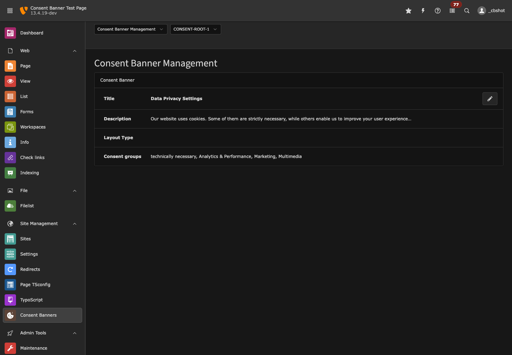
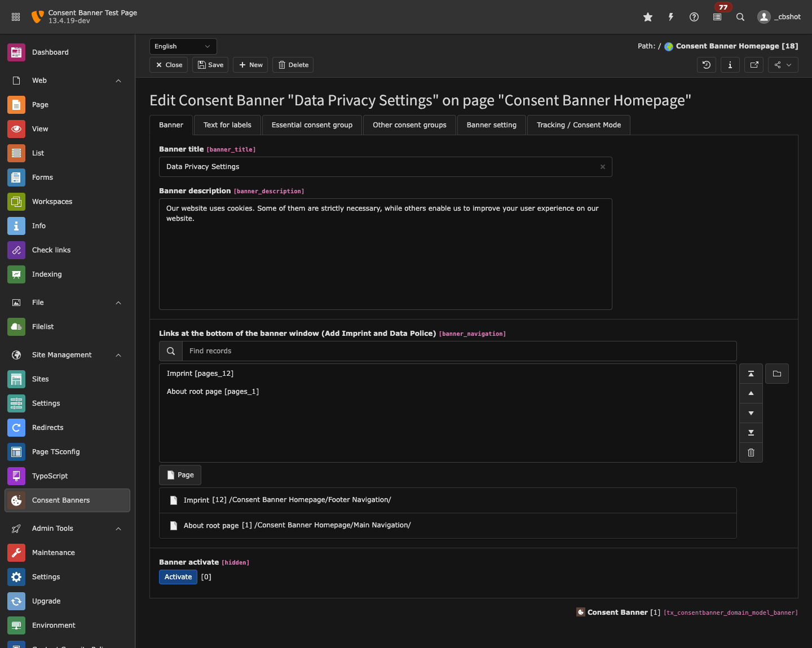
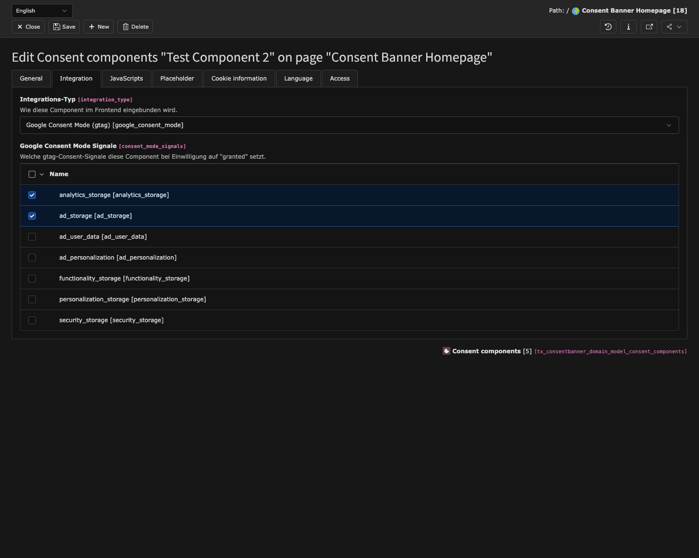
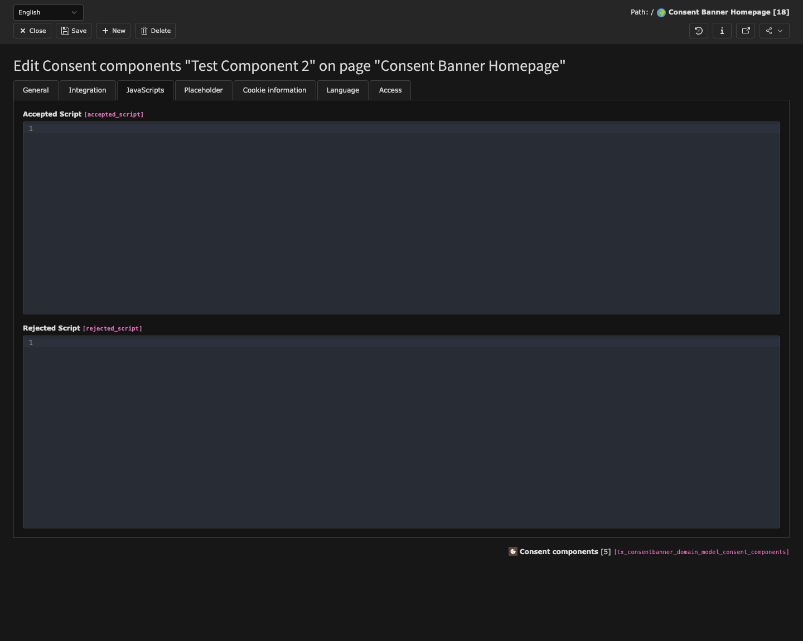
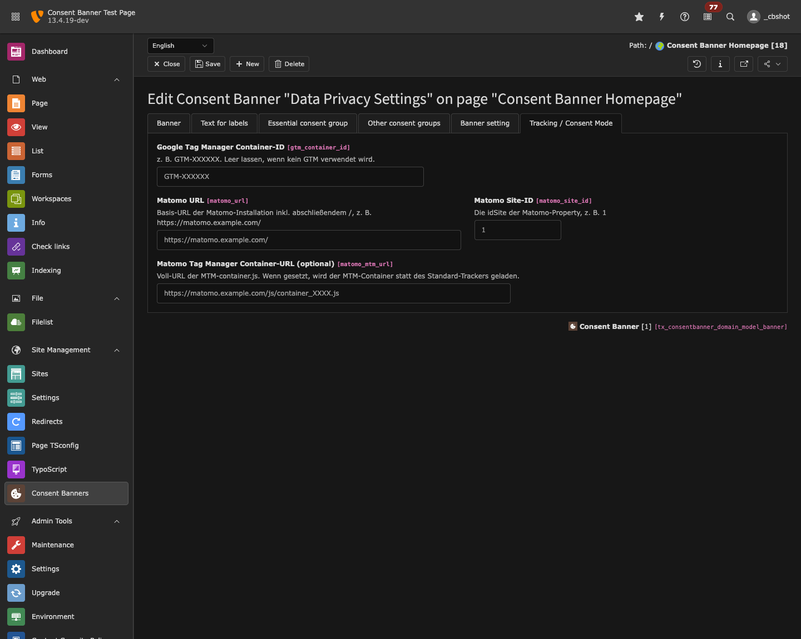

# Consent Banner – Einrichtung & Konfiguration

Diese Anleitung beschreibt, wie der Consent Banner im TYPO3-Backend eingerichtet
und konfiguriert wird und wie die verschiedenen Integrations-Typen im Frontend
wirken.

---

## 1. Überblick

Der Consent Banner besteht aus drei Ebenen:

- **Banner** – ein Datensatz pro Site (Root-Seite). Enthält Texte, Layout,
  Lifetimes und die Tracking-/Consent-Mode-Konfiguration.
- **Gruppen** – z. B. *Technisch notwendig* (essential, immer aktiv),
  *Analytics*, *Marketing*, *Multimedia*.
- **Components** – einzelne Dienste innerhalb einer Gruppe (z. B. YouTube,
  Google Analytics, Matomo). Jede Component bestimmt über ihren
  **Integrations-Typ**, wie sie im Frontend behandelt wird.

Verwaltet wird alles im Backend-Modul **Consent Banners**:

Das Modul zeigt den Banner der aktuell gewählten Site (Auswahl oben rechts über
das Site-Menü). Über das Stift-Symbol wird der Banner bearbeitet.

---

## 2. Voraussetzungen

- Pro Site existiert **ein** Banner-Datensatz (auf der Root-Seite gespeichert).
- Ist noch keiner vorhanden, bietet das Modul einen Button **„Consent Banner
  anlegen"**.
- Das Set *ConsentBanner* muss in der Site aktiv sein (Site-Sets / statisches
  TypoScript), damit Banner-Ausgabe und Consent-Mode-Bootstrap greifen.

---

## 3. Banner bearbeiten

Über den Stift im Modul öffnet sich das Banner-Formular mit mehreren Tabs:

- **Banner** – Titel, Beschreibung, Sichtbarkeit.
- **Text for labels** – Button- und Cookie-Info-Texte (Fallback: Sprachdatei).
- **Essential consent group** – die immer aktive Gruppe *technisch notwendig*.
- **Other consent groups** – weitere, abwählbare Gruppen mit ihren Components.
- **Banner setting** – Layout, Opener (Textlink/Button), Lifetimes.
- **Tracking / Consent Mode** – GTM- und Matomo-Konfiguration (siehe unten).

---

## 4. Integrations-Typen pro Component

Jede Component hat im Tab **Integration** das Feld **Integrations-Typ**. Es
steuert, wie die Component im Frontend eingebunden wird:

| Typ | Verhalten im Frontend |
|-----|-----------------------|
| **Inhaltselement / Iframe (Placeholder)** | Blockt Inhaltselemente/Iframes. Statt des Inhalts erscheint ein Placeholder; nach Einwilligung wird der echte Inhalt **ohne Reload** eingeblendet (reversibel bei Widerruf). |
| **Google Consent Mode (gtag)** | Setzt gtag-Consent-Signale (`consent update`). Google-Tags laden immer, respektieren aber den Consent-Status. |
| **Matomo** | Steuert die Matomo-Einwilligung über `_paq` (`setConsentGiven` / `forgetConsentGiven`). |
| **Script laden** | Lädt bei Einwilligung ein hinterlegtes Script; bei Widerruf wird es entfernt und ein Aufräum-Script ausgeführt. |

### 4.1 Iframe / Inhaltselement

- Feld **Target Content Element** (`component_ce_target`): der/die CType(s), die
  diese Component abdeckt (z. B. `cevideoplayer` für YouTube).
- Optional **Placeholder-Titel/-Text**; ist der Titel leer, wird der
  Component-Titel verwendet.
- Wird im jeweiligen Fluid-Template über `<cb:allowCookie>` genutzt.

### 4.2 Google Consent Mode

- **Google Consent Mode Signale** (`consent_mode_signals`): Mehrfachauswahl,
  welche Signale diese Component bei Einwilligung auf `granted` setzt:
  - `analytics_storage` – Analytics (z. B. GA4)
  - `ad_storage`, `ad_user_data`, `ad_personalization` – Werbung (Google Ads)
  - `functionality_storage`, `personalization_storage`, `security_storage`
- Voraussetzung: **GTM-Container-ID** im Banner (Tab *Tracking / Consent Mode*).

### 4.3 Matomo

- Voraussetzung: **Matomo-URL + Site-ID** (oder MTM-Container-URL) im Banner.
- Matomo-Consent ist global (ein Tracker): sobald **irgendeine** Matomo-Component
  eingewilligt ist, wird `setConsentGiven`/`setCookieConsentGiven` gesendet.

### 4.4 Script laden

Im Tab **JavaScripts** werden die Snippets hinterlegt:

- **accepted_script** – wird bei Einwilligung als `<script>` (mit CSP-Nonce)
  injiziert.
- **rejected_script** – wird bei Widerruf ausgeführt (Cleanup, z. B. Cookies
  löschen), das injizierte Script wird entfernt.

---

## 5. Tracking / Consent Mode (Banner-Ebene)

Im Banner-Tab **Tracking / Consent Mode** werden die Tag-Manager/Tracker global
konfiguriert:

- **Google Tag Manager Container-ID** – z. B. `GTM-XXXXXX`. Leer lassen, wenn
  kein GTM verwendet wird.
- **Matomo URL** – Basis-URL inkl. abschließendem `/`,
  z. B. `https://matomo.example.com/`.
- **Matomo Site-ID** – die `idSite` der Matomo-Property.
- **Matomo Tag Manager Container-URL** (optional) – wenn gesetzt, wird der
  MTM-Container statt des Standard-Trackers geladen.

Die Extension erzeugt daraus früh im `<head>` (vor den Tags):

- **Google:** gtag-Stub + `consent default` (alles `denied`, `security_storage`
  granted, `wait_for_update: 500`) + für wiederkehrende Besucher direkt ein
  `consent update` aus dem Cookie + den GTM-Loader.
- **Matomo:** `_paq` mit `requireConsent` + `requireCookieConsent` + Tracker
  bzw. MTM-Container; für wiederkehrende Besucher direkt `setConsentGiven`.

---

## 6. Verhalten im Frontend

- **Erstbesuch:** Consent-Signale stehen auf `denied`; Iframes werden durch
  Placeholder ersetzt; Scripts werden nicht geladen.
- **Einwilligung** (Banner „Alle akzeptieren"/Auswahl **oder** Toggle direkt im
  Placeholder): ohne Reload werden Iframes eingeblendet, gtag-/Matomo-Consent
  aktualisiert und Scripts injiziert.
- **Widerruf** (Banner erneut öffnen, Häkchen entfernen, speichern): Placeholder
  kehren zurück, Consent-Signale werden auf `denied` gesetzt, Matomo widerrufen
  und injizierte Scripts entfernt.
- **Wiederkehrende Besucher:** Der Consent-Status wird serverseitig aus dem
  Cookie gelesen und bereits im `<head>` angewandt, damit Tags korrekt starten.

Der Consent wird gespeichert in:
- **Cookie** `BbConsentPreferences` = `{ "<component_id>": true|false }`
- **localStorage** (reichhaltiger: Hash, Version, Timestamp, Services)

---

## 7. Content Security Policy (CSP)

- Die von der Extension ausgegebenen Inline-Scripts tragen eine CSP-Nonce.
- Von GTM/Matomo **nachgeladene** Scripts benötigen jedoch Domain-Freigaben in
  der CSP, u. a.:
  - `https://www.googletagmanager.com` (GTM)
  - die eigene Matomo-Domain
  - ggf. `https://www.youtube.com` / `https://www.youtube-nocookie.com` (Video)
- Ohne diese Freigaben blockt der Browser das Laden der Tags.

---

## 8. Screenshots aktualisieren

Die Backend-Screenshots in `Documentation/Images/` werden mit dem Skill
`backend-screenshot` (`.claude/skills/backend-screenshot/`) erzeugt – siehe
dessen `SKILL.md`.
